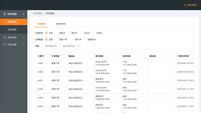
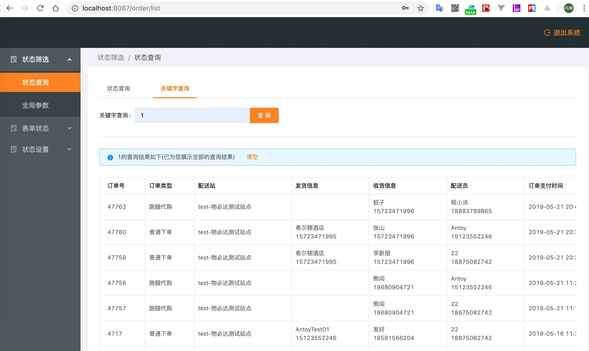
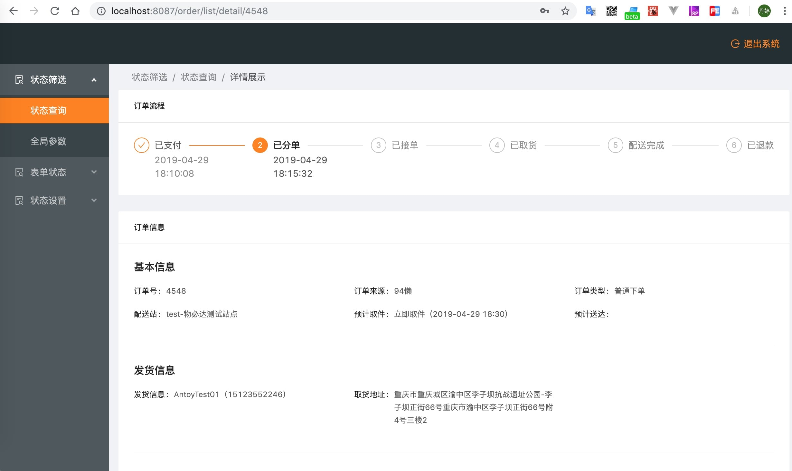
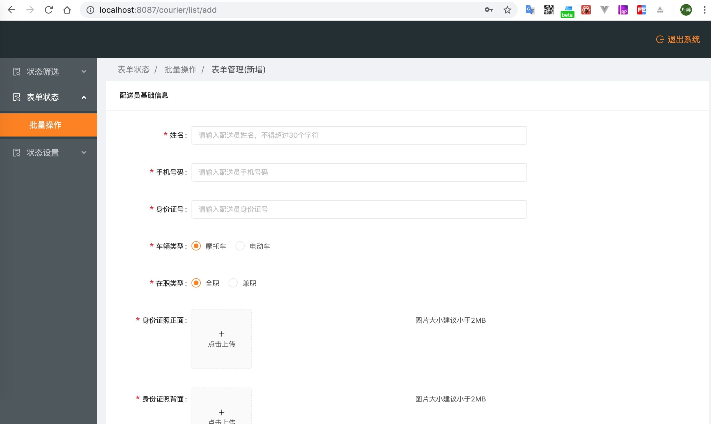
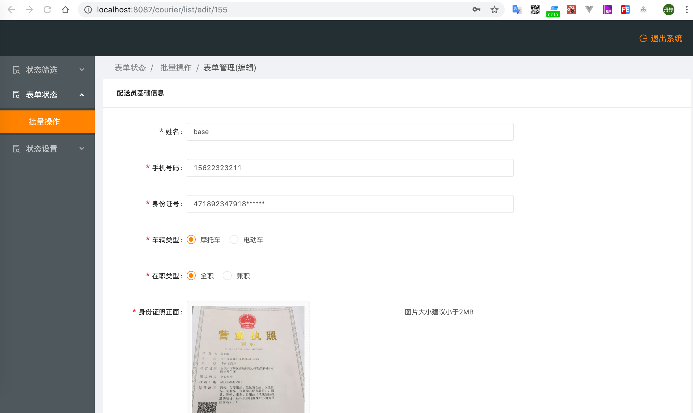
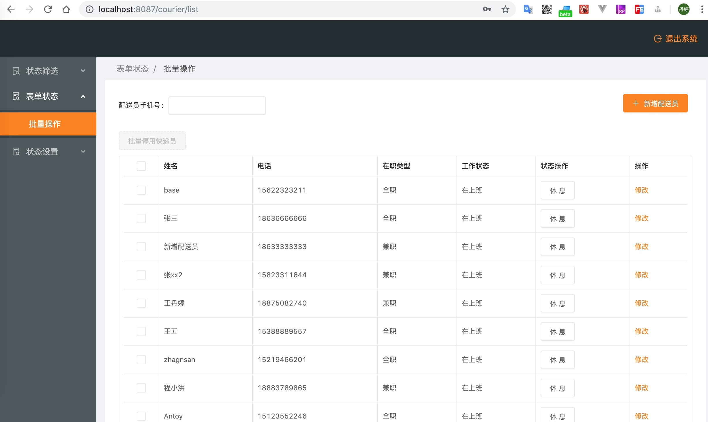
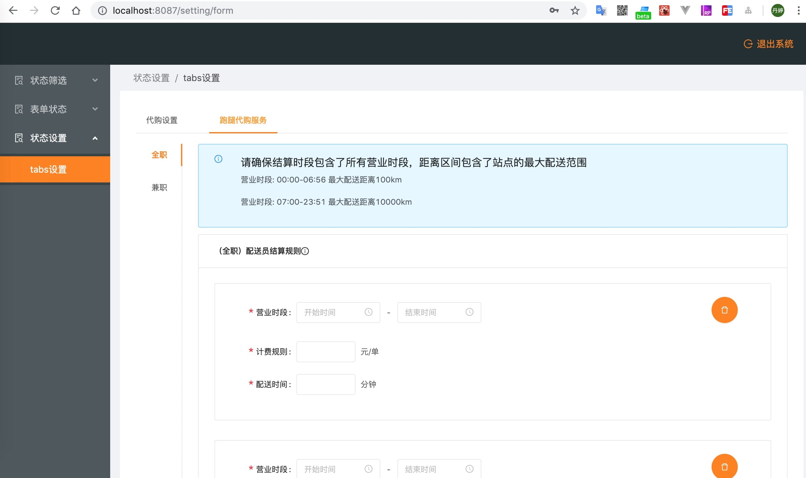

<div align="center">

  # redux状态管理系统案例模版

  ##### 一个简单的使用redux状态管理的系统模版

  

  

</div>

- 使用框架：[react](https://reactjs.org/)、
[redux](https://redux.js.org/)、[antd](https://ant.design/index-cn)、[less](http://lesscss.org/)
- 使用的路由技术：[react-router](https://reacttraining.com/react-router/web/guides/quick-start)
- 使用redux相关技术: [react-redux](https://react-redux.js.org/)、[react-router-redux](https://github.com/reactjs/react-router-redux)、[redux-logger](https://www.npmjs.com/package/redux-logger)、[redux-thunk](https://github.com/reduxjs/redux-thunk)、[reselect](https://github.com/reduxjs/reselect)
- 使用的网路请求库：[axios](https://github.com/axios/axios)
- 搭建环境技术：[webpack](https://webpack.js.org/)、[babel](https://babeljs.io/)、[eslint](https://eslint.org/)、[prettier](https://prettier.io/)、[stylelint](https://stylelint.io/)、[husky](https://www.npmjs.com/package/husky)、[lint-staged](https://www.npmjs.com/package/lint-staged)

## 特性

- 可直接使用：已完成基本的配置，可直接写业务
- 使用antd： 开箱即用的高质量 React 组件
- 共享状态：利用redux状态管理器
- 代码检测：利用eslint以及stylelint对您写的代码进行规范检测，如果不通过规范，则不能提交代码

## 预览

```shell
$ git clone git@github.com:wangdanting/redux-template-system.git
$ cd redux-template-system
$ yarn install
$ yarn start         # 访问 http://localhost:8087
```

## 案例

- 关键字查询列表与详情页

<div align="center">

  

  

</div>

- 表单新增与编辑

<div align="center">

  

  

</div>

- 批量操作

<div align="center">

  
  
  

</div>

## 开发

### 路由配置

在`/src/router.config.js`里配置

```javascript
import Login from './pages/Login';
import BasicLayout from './layouts/BasicLayout';
import OrderQuery from './pages/Order/OrderQuery';
import OrderDetail from './pages/Order/OrderQuery/OrderDetail';

export default [
  {
    path: '/login',
    exact: true,
    component: Login
  },
  {
    path: '/',
    component: BasicLayout,
    routes: [
      {
        path: '/',
        redirect: '/order/list'
      },
      {
        path: '/order',
        name: '状态筛选',
        icon: 'file-search',
        routes: [
          {
            path: '/order',
            redirect: '/order/list'
          },
          {
            path: '/order/list',
            name: '状态查询',
            exact: true,
            component: OrderQuery
          },
          {
            path: '/order/list/detail/:id',
            name: '详情展示',
            hideInMenu: true, //不显示在菜单中
            component: OrderDetail
          }
        ]
      }
    ]
  }
];
```

### 代理配置

在`/webpack.config.js`文件中修改代理服务

```javascript
  proxy: {
    '/api': {
      target: 'https://wbd.api.t.jiabangou.com',
      changeOrigin: true,
      secure: true
    }
  }
```

### 业务

在 `/src/pages` 下建立业务文件

具体请看例子参考

### 请求

运用已经封装好的request，下面👇为例子

```javascript
  import request from '@/utils/request';

  request('/sessions/create', {
    method: 'post',
    headers: { 'Content-Type': 'application/x-www-form-urlencoded' },
    data: qs.stringify(submitData)
  })
    .then(({ result }) => {
      Storage.session.set('Authorization', result);
      dispatch(push('/order/list'));
    })
    .finally(() => {
      dispatch(setSubmitting(false));
    });
```

### 状态管理

将要执行的动作命名 将文件放在 `/src/constants`下，下面👇为例子

```javascript
  // 登录
  export const LOGIN_SUBMITTING = 'LOGIN_SUBMITTING';
```

[Action](https://redux.js.org/basics/actions) 将文件放在 `/src/actions` 下，下面👇为例子

```javascript
  const setSubmitting = loading => ({ type: types.LOGIN_SUBMITTING, loading });
```

[Middleware](https://redux.js.org/advanced/middleware) 中间件实现，下面👇为例子

```javascript
const setSubmitting = loading => ({ type: types.LOGIN_SUBMITTING, loading });

const handleLogin = submitData => dispatch => {
  dispatch(setSubmitting(true));

  request('/sessions/create', {
    method: 'post',
    headers: { 'Content-Type': 'application/x-www-form-urlencoded' },
    data: qs.stringify(submitData)
  })
    .then(({ result }) => {
      Storage.session.set('Authorization', result);
      dispatch(push('/order/list'));
    })
    .finally(() => {
      dispatch(setSubmitting(false));
    });
};
```

[reducers](https://redux.js.org/basics/reducers)，下面👇为例子

```javascript
import * as types from '@/constants';
import { combineReducers } from 'redux';

export const submitting = (state = false, action) => {
  switch (action.type) {
    case types.LOGIN_SUBMITTING:
      return action.loading;
    default:
      return state;
  }
};

const login = combineReducers({
  submitting
});

export default login;
```

## 代码检测

`fix格式项目`(提交代码时会进行代码格式的检查，如果报错，则在命令行中输入👇命令，查看报错原因)

```shell
  yarn lint:fix
```

## 支持环境

| [](http://godban.github.io/browsers-support-badges/)</br>Chrome | [](http://godban.github.io/browsers-support-badges/)</br>Safari|
| --------- | --------- |
| last 2 versions| last 2 versions

## 模版

```javascript
- actions (redux actions文件)
- common (公共资源文件)
- components (封装组件)
  - BtnGroup (表单最地下的两个按钮)
  - DescriptionList (描述列表)
  - ResultTable (table分页)
  - UploadImg (上传/编辑图片)
- constants (actions 变量)
- excludeFile (不打包编译的文件)
- layouts (框架布局)
- pages (业务)
  - Courier
  - DeliverySettings
  - Login
  - Order
- utils
  - exportFile (封装下载文件)
  - handleBreadcrumb (封装处理面包屑导航)
  - pubsubmsg (封装订阅和发布)
  - renderRoutes (封装处理路由)
  - request (封装请求)
  - storage (封装Storage)
  - util (公共方法)
- router.config.js (路由配置)
- variables.less (less变量)
```

## 开发约定

- 页面的初始数据 必须写注释

```javascript
state = {
  provinceList: [], // 省份列表
  cityList: [], // 市区列表
  districtList: [], // 县列表
}
```

- 页面的方法 必须写注释

```javascript
/**
  *  查询计费规则
  */
showModal = () => {
  this.setState({
    isShow: true
  })
}
```

- 封装公共方法 要写清楚注释和参数格式和返回格式

```javascript
/**
  * 手机号格式化
  * @param {string | number} mobile 手机号
  * @returns '188 8888 8888'格式的手机号
  */
const formatMobile = (mobile) => {
  if (!(regMobile.test(mobile))) {
    return '';
  }
  return String(mobile).replace(/(^\d{3}|\d{4}\B)/g, "$1 ");
};
```

- 封装公共组件，需写demo

- 公共的样式变量需引用 variables.less

```javascript
@import './variables.less';

.abc {
  color: @basicColor;
}
```