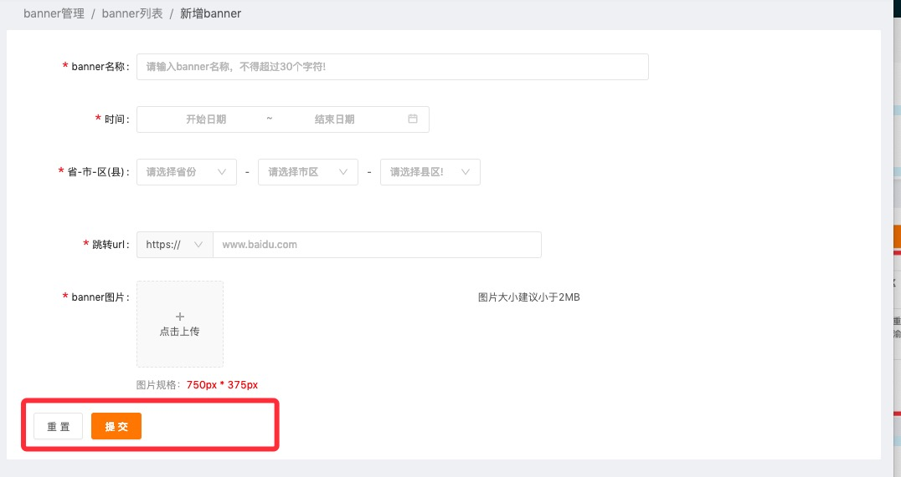

表单页最下面的按钮。



````jsx
import BtnGroup from '@/component/BtnGroup';

ReactDOM.render(
  <BtnGroup
    leftText='取消'
    leftOnClick={this.cancel}
    rightText='保存'
    rightOnClick={this.handleSubmit}
/>
, mountNode);
````
