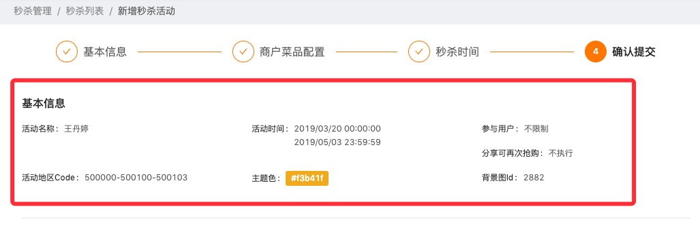

基本描述列表。



````jsx
import DescriptionList from '@/component/DescriptionList';

const { Description } = DescriptionList;

ReactDOM.render(
  <DescriptionList size="large" title="title">
    <Description term="Firefox">
      A free, open source, cross-platform,
      graphical web browser developed by the
      Mozilla Corporation and hundreds of
      volunteers.
    </Description>
    <Description term="Firefox">
      A free, open source, cross-platform,
      graphical web browser developed by the
      Mozilla Corporation and hundreds of
      volunteers.
    </Description>
    <Description term="Firefox">
      A free, open source, cross-platform,
      graphical web browser developed by the
      Mozilla Corporation and hundreds of
      volunteers.
    </Description>
  </DescriptionList>
, mountNode);
````
